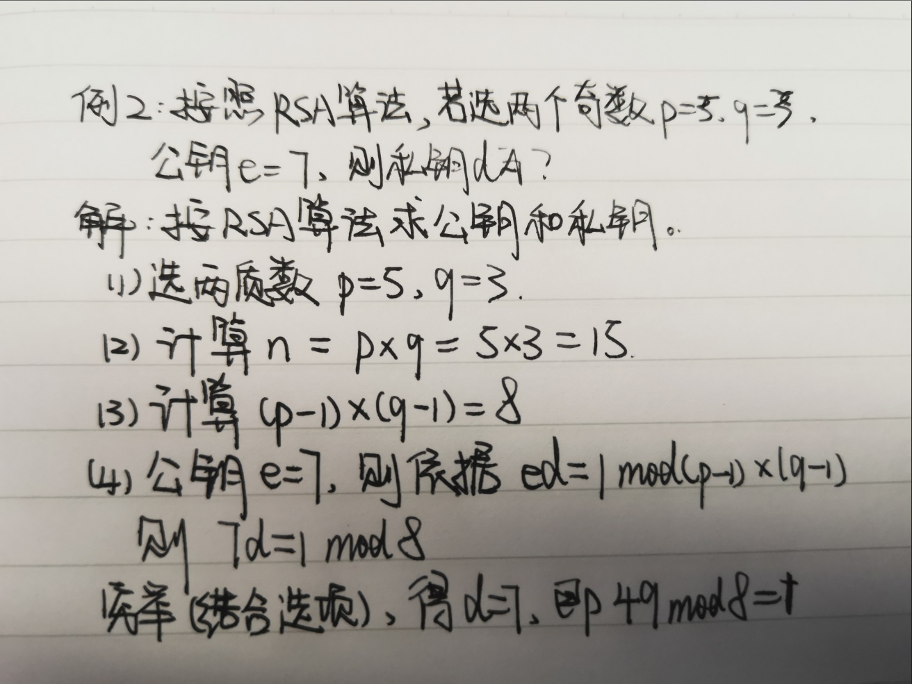
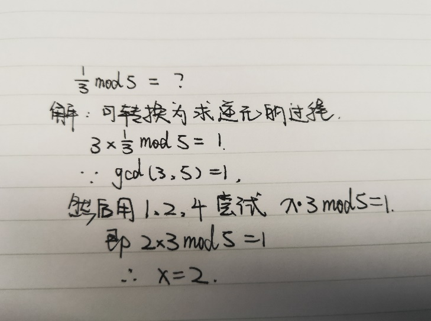

# 第三章 密码学（二）*

## 3.5 公钥密码体质

该密码体质需要单向陷门门函数构造。

y=f(x)条件：

- 具有陷门
- 已知x，计算y很容易
- 一致y，不知陷门计算x难，若知道陷门则容易。

困难问题：

- **因子分解问题**：计算素数乘积很容易(p*q->n)，而计算因子分解困难(n->p\*q)。
- **离散对数问题**：计算素数幂乘容易(x^y->z)，而计算对数困难(log_x z->y)。

公钥密码体制特点：
- 加密：C=E(M, K_e)
- 解密：M=D(C, K_d)
- 计算上不能由K_e求出K_d
- 加密算法E 和解密算法D 都是高效的

### 1. RSA
#### 1.1 欧几里得算法  

##### 1. 基本算法，用于求解最大公约数  

原理：设a=qb+r，其中都是整数，则gcd(a,b) = gcd(b,r) = gcd(b,a % b)  

##### 2. 扩展欧几里德算法，主要用于求解不定方程，模线性方程，模的逆元等。  

算法原理：对于不完全为0的非负整数，a,b,gcd(a,b)表示，a,b的最大公约数，必然存在整数对x,y，使得gcd(a,b)=ax+by

#### 1.2 用辗转相除法求逆元

求A关于模N的逆元B，即求整数B，使得A*BmodN=1(A,N互素)

- 对余数辗转相除

- 对商数逆向排列
  

  

#### 1.3 RSA 算法

典型的非对称加密算法，该算法基于“**大素数因数分解**”。核心是**模幂运算**。
$$
D(E(M))=(M^e)^d=(M^d)^e=E(D(M))mod\ n
$$
因此利用RSA可以同时实现数字签名和数据验证

##### 1. 生成过程

1. 选出两个大质数p和q，使得p!=q

2. 计算
   $$
   p\times q=n
   $$

3. 计算
   $$
    \psi (n)=(p-1) \times (q-1)
   $$

4. 选择e，是的1 < e < (p-1)(q-1)，并且e和(p-1)(q-1)互素
   
5. 计算解密密钥，使得
    $$
    ed=1 mod (p-1)(q-1)
    $$
    
- 公钥 = e, n
  
- 私钥 = d, n
  
  公开n参数，n又称为模
  
  消除原始质数p和q
  
  

加解密过程如下：
- 加密
  
$$
C=M^emod\ n
$$

- 解密
  $$
  M=C^dmod\ n
  $$
  

数字签名的过程如下：
- 签名
  $$
  M^dmod\ n
  $$
  
- 验证签名
  $$
  (M^d)^emod\ n
  $$

#### 1.4 例题

【例1】求61关于模105的逆元   P74

解：辗转相除法。（考试时候数值较小一般可以穷举）

【例2】按照RSA算法，若选两个奇数p=3，q=3，公钥e=7，则私钥d为？P75

【例3】令p=47，q=71，求用RSA算法加密的公钥e和私钥d

解：解题方法如例2，只是公钥需要自行随机选取，和欧拉函数计算的值互质即可，剩下的模函数一般穷举即可，考试时候不会出现像例3一样大的数值，穷举即可。然后得到公私钥。

### 2. Diffe-Hellman 与Gamal体制

#### 2.1 Diffe-Hellman密钥交换体制

完成通信双方的“**对称秘钥**”交互，在不安全的通信环境（被监听）下，也不会造成秘钥泄露。

流程如下：

第一步：公开（p, g）

第二步：通信双方Alice和Bob交换秘钥

- Alice选择随机秘钥x (x <= x < p - 1)，发送给Bob：A=g^x (mod p)
- Bob选择随机秘钥y (2 <= y < p - 1)，发送给Alice：B=g^y (mod p)

第三步：双方得到公共秘钥

- Alice结合随机秘钥x和已收到Bob的信息，通过计算K=B^x(mod p)，得到公共秘钥K
- 同样，Bob通过计算K=A^y(mod p)，也得到公共秘钥K

至此，双方进行了安全的对称秘钥交互

#### 2.2 ELGamal体制

ELGamal是一种改进方案，给予“**离散对数问题**”上的“**公开秘钥秘钥体制**”。离散对数问题是指：对于比较大的整数y、g、p，求出一个整数x满足y=g^xmod p是非常困难的。

ELGamal算法略？？？考试基本不会涉及

### 3. 椭圆曲线密码

椭圆曲线加法的数学表示：
$$
y^2=x^3+ax+b(mod\ p)
$$
其中x和y取值范围[0, p-1]之间的整数

点P1(x1, y1)、P2(x2, y2)为椭圆曲线上的两个点，则P1+P2=P3=(x3, y3)
$$
\left\{
\begin{aligned}
    x_3=\lambda^2-x_1-x_2(mod\ p) \\
    y_3=\lambda(x_1-x_3)-y_1(mod\ p)\\ 
    \lambda=
        \left\{
        \begin{aligned}
            (y_2-y_1)/(x_2-x_1),\ P_1\neq P_2 \\
            (3x_1^2+a)/2y_1, \ P_1=P_2
        \end{aligned}
        \right.
\end{aligned}
\right.
$$
如果人=无穷大，则P3=无穷大

如果任意点，规定P+无穷大=P

【例1】：设定p=5，y^2=x^3+4x+4，x和y取值为[0, 4]上的所有整数。

解：通常考试时候数据量不大，将区间的整数值带入进行穷举即可

【例2】：y^2=x^3+4x+4(mod 5)，计算(1, 2) + (4, 3)

解：涉及到有理分数求逆元，1/3mod5

加解密过程略

椭圆曲线计算比RSA复杂得多，所以 椭圆曲线秘钥比RSA短。一般认为**160**位长的椭圆曲线密码相当于1024位RSA密码的安全性。我国第二代居民身份证使用的是**256位的椭圆曲线密码**。

**SM2**算法是国家密码管理局发布的椭圆曲线公钥密码算法，用于在我国商用密码体系中替换RSA算法。

## 3.6 数字签名

数字签名的作用就是确保A发送给B的信息就是A本人发送的，并且没有篡改。

数字签名体制包括**施加签名**和**验证签名**两个方面。

- 基本的数字签名过程如下：
  1. A使用“摘要”算法（如SHA-1、MD5等）对发送信息进行摘要
  2. 使用A的私钥对消息摘要进行加密运算，将加密摘要和原文一并发给B。

- 验证签名的基本过程如下：
  1. B接收到加密摘要和原文后，使用和A同样的“摘要”算法对原文再次摘要，生成新的摘要。
  2. 使用A公钥对加密摘要解密，还原成原摘要。
  3. 两个摘要对比，一致则说明由A发出且没有经过任何篡改。

数字签名功能有信息身份认证、信息完整性检查、信息发送不可否认性，但不提供原文信息加密，不能保证对方收到消息，也不对接收方身份进行验证。数字签名最常用的实现方法建立在公钥密码体制和安全单向散列函数的基础之上。

## 3.7 认证

认证用于证实某事是否真实或有效的过程。认证的原理是：通过核对人或事的特征参数（如智能卡、指纹、密钥、口令等），来验证目标的真实性和有效性。

### 1. 身份认证

#### 1.1 口令认证

好的口令特点是：使用多种字符、具有足够长度、尽量随机、定期更换。

略。。。？

注：口令认证期间加入时间量，可以抵御重放攻击

#### 1.2 生物特征识别

经验表明身体特征（指纹、掌型、视网膜、虹膜等）和行为特征（签名、语音、步态等）可以对人进行唯一标示，可以用于身份识别。目前指纹识别技术最为深入。

### 2. 报文认证

报文认证是保证通信双方能够验证每个报文的发送方、接收方、内容和时间性的真实性和完整性。报文认证确保：

- 报文是意定发送方发出
- 报文是意定接收方接收
- 报文内容没有出现错误或者没有被篡改
- 报文是按指定的次序接收的

## 3.8 秘钥管理

密钥管理遵循的原则有：全程安全原则、最小权利原则、责任分离原则、密钥分级原则、密钥设定与更换原则等。

名词：KDC（密钥分配中心）、CA（证书授权中心）

### 1. kerberos（对称密钥分配）

该协议主要用于计算机网络身份鉴别，要是密钥分配中心的核心。kerberos进行密钥分配时使用AES、DES等分配方式。

用途：可实现单点登录

组成：鉴别服务器AS、票据授予服务器TGS

流程：用户先向AS申请初始票据，然后从TGS获得会话密钥

### 2. 非对称公钥分配

#### 2.1 PKI，公钥基础设施

PKI是一组规则、过程、人员、设施、软件和硬件的集合，用来进行公钥证书的发放、分发和管理。

典型的PKI系统由5个基本部分组成：**证书申请者、RA注册中心、CA认证中心、证书库和证书信任方**。

#### 2.2 数字证书

数字证书才用公钥体制进行加密和解密。每个用户有一个私钥来解密和签名；同时每个用户还有一个公钥用来加密和验证。

【例题】说明数字证书、CA签名、证书公钥的作用

答：某网站向CA申请了数字证书，用户通过CA的签名来验证网站的真伪。在用户与网站进行安全通信的时候，用户可通过证书中的公钥进行加密和验证，该网站通过网站的私钥进行解密和签名。

（1）X.509格式

（2）证书发放

（3）证书吊销

（4）证书验证

验证证书可以从以下三个方面着手：

（1）验证证书的有效期

（2）验证证书是否被吊销

（3）验证证书是否是上级CA签发的