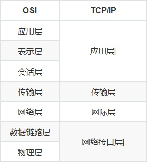
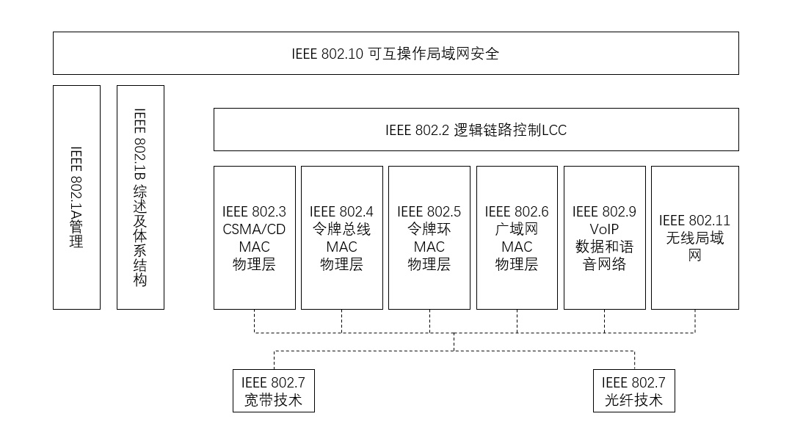

# 第四章 计算机网络基础

## 4.1 网络体系结构

1974年，IBM第一次提出了系统网络体系结构（SVA）的概念。第一个应用了分层的方法。

### 1. OSI

开放系统互连参考模型，简称OSI模型。从低到高分别为：1⃣️物理层、2⃣️数据链路层、3⃣️网络层、4⃣️传输层、5⃣️会话层、6⃣️表示层、7⃣️应用层

（1）物理层：通过各类协议定义了网络的机械特性、电气特性、功能特性和规程特征

（2）数据链路层：应具有的功能如下：

	- 链路的建立、拆除和分离	
	- 帧定界和帧同步
	- 顺序控制
	- 差错检测、恢复
	- 链路标识、流量/拥塞控制

（3）网络层：功能有

```
- 路由选择和中继
- 激活和终止网络连接
- 链路复用
- 差错检测和恢复
- 流量/拥塞控制
```

（4）传输层：利用实现可靠的"端到端的数据传输"能实现数据"分段、传输和组装"，还能实现差错控制，流量/拥塞控制等。

（5）会话层

（6）表示层

（7）应用层


下面再介绍几个重要概念：

- 封装
- 网络协议：语法、语义、时序关系
- PDU
- 实体
- 服务
- 服务原语
- 服务数据单元


### 2. TCP/IP参考模型（实用）

TCP/IP参考模型和OSI参考模型有较多的相似之处，各层也有一定的对应关系，具体对应关系如图所示：



- 应用层：TCP/IP参考模型的应用层包含了所有高层协议。该层与OSI的会话层、表示层和应用层对应。
- 传输层：TCP/IP参考模型的传输层与OSI的传输层对应。该层允许源主机与目标主机上的对等体之间进行对话。该层定义了两个端到端的传输协议：TCP和UDP协议。
- 网际层：TCP/IP参考模型的网际层与OSI的网际层对应。该层负责为经过逻辑互联网络路径的数据进行路由选择。
- 网络接口层：TCP/IP参考模型的最底层是网络接口层，该层在TCP/IP参考模型中并没有明确规定。


TCP/IP参考模型是一个协议簇，各层对应的协议已经得到了广泛的应用，其对应关系也是必考的重点，TCP/IP参考模型主要协议的层次关系如图所示：


## 4.2 物理层

### 1. 常见的有线传输介质

同轴电缆、屏蔽双绞线、非屏蔽双绞线、光纤、无线、蓝牙等

1. 同轴电缆

$$
分类
\left\{
\begin{aligned}
    宽带同轴电缆\\ 
    基带同轴电缆
        \left\{
        \begin{aligned}
            细同轴电缆 \\
            粗同轴电缆
        \end{aligned}
        \right.
\end{aligned}
\right.
$$

2. 屏蔽双绞线，贵，100m内高达155mb/s

3. 非屏蔽双绞线：

   线序：

   - 标准568A：绿白、绿、橙白、蓝、蓝白、橙、棕白、棕
   - 标准568B：橙白、橙、绿白、蓝、蓝白、绿、棕白、棕

4. 光纤：光导纤维，分为单模光纤和多模光纤

5. 无线传输技术

   - IEEE 802.11：无线局域网标准，P95页

   - 蓝牙、3G、4G略

   - 5G：2017年12月21日，3GPP RAN会议上，5GNR首发版本公布

     LDPH长码 -> 高通

     Polar短码  -> 华为

### 2. 常见网络设备

交换机、路由器、防火墙、VPN

注：路由器工作在OSI模型的网络层


## 4.3 数据链路层

### 1. 点到点协议：

PPP、PPPoE

### 2. 局域网的数据链路层结构

802 分类：

- 逻辑链路控制LLC：无关硬件，实现流量控制（不常用）
- 媒体接入控制层MAC：硬件相关、提供硬件和LLC层的接口

#### 2.1 MAC：

功能：数据帧封装/卸装，帧的寻址和识别、帧的接受与发送，链路的管理，帧的差错控制

访问方式：CSMA/CD、令牌环、令牌总线

格式：帧由8个字段组成

| 名称     | 长度    | 备注                          |
| -------- | ------- | ----------------------------- |
| 前导字段 | 7       |                               |
| 帧起始符 | 1       | 10101011                      |
| 目的地址 | 6       |                               |
| 原地址   | 6       |                               |
| 类型     | 2       | 考试中标记为长度              |
| 数据     | 0～1500 | IP数据报，数据+填充：46～1500 |
| 填充     | 0～46   |                               |
| 校验和   | 4       |                               |

注：以太网最小帧长为64字节，是指从"目的地址带校验和"的长度

#### 2.2 MAC地址

​		也叫硬件地址，由48比特组成，厂商编号(24)+序列号(24)，在底层网络传输中，是通过物理地址来标识主机，它一般是全球唯一的。

### 3. CSMA/CD

载波监听多路访问/冲突检测，争用型介质访问控制协议。

工作原理：先监听再发送；边发送边监听；有冲突等会儿发

适合实时传输（IEEE 802.3ae采用全双工方式，放弃了CSMA/CD）

几个重要概念：多路访问、载波监听、冲突检测、退避算法（截断的二进制指数退避算法）

### 4. IEEE 802系列协议




重点：IEEE802.3 以太网规范，定义了CSMA/CD标准的媒体访问控制（MAC）子层和物理层规范。P101

- 802.3z：千兆以太网，仅适用于半双工模式
- 802.3ae：万兆以太网，仅支持光纤传输
- 千兆、万兆最小帧长为512字节


## 4.4 网络层

是OSI中第三层，常见的协议有：IP、ICMP、APRP和RARP、IPv6、NAT、MNAPT

#### 1. IP协议和IP地址

- IP数据报头（以及各个部分长度和作用）

1. IPv4地址（点分十进制）

   - A类地址范围：1.0.0.0～126.255.255.255（子网8，主机位24）

     其中：私有地址：10.x.x.x

     ​            保留地址：127.x.x.x，回环地址

   - B类地址范围：128.0.0.0～191.255.255.255（子网位16，主机位16）

     其中：私有地址：172.16.0.0～172.31.255.255

     ​            保留地址：169.254.x.x。IP地址自动获取，但没有找到相应的DHCP服务，则PC从保留地址中获取一个。

   - C类地址范围：192.0.0.0～223.255.255.255（子网位24，主机位8）

     其中：私有地址：192.168.x.x

   - D类地址：244.0.0.0～239.255.255.255，不区分网络地址和主机地址，该类地址用于组播。

     其中：224.0.0.1 代表所有主机与路由器

     ​           224.0.0.2 代表所有的组播路由器

     ​           。。。略

   - E类地址：240.0.0.0～247.255.255.255，不区分

   

   几类特殊的地址：P107

   | 名称     | 格式                       | 特点                       | 可作为源地址 | 可作为目标地址 |
   | -------- | -------------------------- | -------------------------- | ------------ | -------------- |
   | 有限广播 | 255.255.255.255            |                            | x            | y              |
   | 直接广播 | 主机字段为1，如192.1.1.125 | 不被路由，送到所有主机     | x            | y              |
   | 网络地址 | 主机位全0，如192.168.1.0   | 广播被路由，转往每台pc     | x            | x              |
   | 全0地址  | 0.0.0.0                    | 表示一个子网               | y            | x              |
   | 回环地址 | 127.x.x.x                  | 表示任意主机向自己发送数据 | y            | y              |

   

#### 2. 地址规划和子网规划

##### 2.1 子网掩码

区分网络地址，主机地址，广播地址。P108

形式是网络号全1，主机号全0。点分十进制，建网比特数。

(8).(8)|(8).(8)

- 子网络数量：2 ^ (16 - n)
- 可用主机数：2 ^ n - 2。（减去全0和全1）

默认掩码：该段地址全1

- A类：255.0.0.0
- B类：255.255.0.0
- C类：255.255.255.0

##### 2.2地址结构

IP::={<网络号>, <子网号>, <主机号>}

##### 2.3 VLSM和CIDM

1. 可变长子网掩码（VLSM）：对部分子网再进行划分

   寻址效率高，IP地址利用率高

   可理解为：把大网划分成小网

2. 无类别域间路由（CIDM）

   路由使用前缀来描述有多个位是网络位，剩下的为主机位

   提高IPv4的可扩展性和效率，减少路由表大小

   可理解为小网合并成大网

##### 2.4 IP地址和子网划分！！！

题型：例题略

1. 给定IP和掩码，求网络地址，广播地址，子网范围，子网能容纳的最大可用主机数
2. 给定现有的网络地址和掩码，并给出子网数目，计算子网掩码以及可分配的主机数
3. 给出网络类型，求划分子网数
4. 使用汇聚路由将给出的多个子网合并为超网，求超网地址


#### 3. ICMP

用于IP主机和路由器之间传递控制消息。

- 报文格式：封装在IP数据报中
- 分类：差错报告报文和询问报文
- 应用：
  - ping 命令：使用回送应答个会送请求报文
  - traceroute 命令：使用时间超时报文和目的不可达报文


#### 4. ARP和RARP

地址解析协议ARP是将32位的IP地址转为48位的以太网地址，反向地址解析协议则反过来。ARP报文峰状在以太网帧中发送。

##### 4.1 ARP原理

第一步：发送ARP请求：广播方式发送ARP请求分组

第二步：ARP响应：单播形式响应

第三步：主机写入高速缓存：记录IP和MAC对应关系，有一定的生存时间

##### 4.2 ARP病毒

使用ARP欺骗手段破坏正确的关系

eg：想被攻击主机发送虚假ARP报文，目的地址为网关IP，目的MAC地址为感染木马的主机MAC地址。

还能发送大量的广播包，造成广播风暴。

##### 4.3 ARP欺骗

类似于中间人攻击

##### 4.4 发现和解决

1. 接入交换机端口绑定固定的MAC地址
2. 查看接入交换机端口异常：一个端口段时间出现多个MAC地址
3. 安装ARP防火墙
4. 发现缓存中MAC不对，执行`arp -d`清除缓存
5. 设置静态绑定


#### 5. IPv6

长度为128位，通常写作8组，每组4个16进制数。P116

- 书写规则
  - 每段起始0可以忽略
  - 全0组成可用"::"替代
- 单播地址（相比多播高位8位总是FF）
  - 全球单播地址
  - 链路本地单播地址
  - 任意播地址
  - 地区本地单播地址
  - 组播地址


#### 6. NAT、NAPT

网络地址转换，一般将私有地址转换为公网地址，实现访问公网。有助于减少IP地址枯竭

网络地址端口转换NAPT，多对一地址转换，端口不同，共享同一地址。好处：隐藏了网络内部的IP配置，节省了资源。


## 4.5 传输层（重点TCP和UDP）

网络服务分为面向连接和无连接服务服务两种方式

### 1. TCP

1. TCP报文收不格式

2. TCP三次握手连接

3. TCP四次握手断开连接

4. TCP协议的重传时间

TCP可靠的一个保证机制就是"超时重传"，超时重传核心就是超时重传时间的计算

重要参数：	

- 往返时间RTT
- 加权平均往返时间RTTS
- 重传超时时间RTO
- 新的RTTD

5. 拥塞控制

   TCP拥塞控制机制包括：慢开始、拥塞避免、快重传、快恢复


### 2. UDP

用户数据报协议UDP，不可靠无连接服务，UDP更高效。

头部结构略。

常用端口：22=SSH、53=DNS


引：[TCP可靠传输&流量控制&拥塞控制](https://my.oschina.net/manmao/blog/601585)


## 4.6 应用层

### 1. DNS

域名系统是把主机域名解析成IP地址。DNS主要基于UDP协议，较少情况使用TCP，端口号均为**53**。

构成：DNS名字空间、域名服务器、DNS客户机。

1. 名字空间，注：每部分不超过63个字符，总长度不超过255。

2. 域名服务器：为客户机/服务器模式（C/S）

   分类：

   - 层次：根域名服务器、顶级域名服务器、权限域名服务器、本地域名服务器

   - 作用：主域名服务器、辅域名服务器、缓存域名服务器、转发域名服务器

   主：具有域名数据库，一个域有且只有一个主域名服务器

   辅：具有DB（备份，负载）

   缓存：性能，耗时短，无DB

   转发：有DB

3. 域名解析

   方法有：递归查询，迭代查询

   

   资源记录名称：A、AAAA、CNAME、MX、NS、PTR


### 2. DHCP
动态主机配置协议，通过该协议，DHCP服务器为DHCP客户端动态IP地址分配（分配不到用默认的）。
- DHCP 基本知识

  跨多个网段必须使用DHCP中继代理

  DHCP使用UDP的67端口，保留UDP的68来接受回复的消息

  windows中没找到时，获取的IP为169.254.x.x

- 工作过程

  1. 客户端发送IP租用请求
  2. 服务器提供租用请求
  3. 客户端租用选择
  4. 客户端租用确认
  5. 客户端重新登录
  6. 更新租约


### 3. WWW、HTTP

#### 3.1 WWW

WWW万维网是一个规模巨大，可以互联的资源空间。核心有三个主要标准构成

- URL：统一资源标识符：用于资源定位
- HTTP：超文本传输协议，规定浏览器和服务端如何交互
- HTML：超文本标记语言：描述网页的标记语言

#### 3.2 HTTP

使用TCP的**80**端口。

不使用UDP的原因：打开一个网页必须传送很多数据，而TCP协议提供的传输控制，可以按照顺序组织数据，还可以对错误数据进行纠正


### 4. Email

#### 4.1 常见电子邮件协议

- 简单邮件传输协议**SMTP**：主要负责底层的邮件西永如何从一台发送到另一台，工作在TCp的**25**号端口。

- 邮局协议**POP3**：把邮件从邮件服务器传输到计算机的协议，工作在TCP的**110**号端口。

  特点：用户从POP服务器中读取了邮件，POP服务器就会删除该邮件。

- Internet邮件访问协议**IMAP**：新版本IMAP4，POP3代替协议，工作在TCP的**143**号端口。

#### 4.2 邮件安全

SMTP不提供加密服务，攻击者可以拦截到数据。

常见攻击方式：

- 利用邮件服务器操作系统漏洞
- 利用邮件服务器软件本身的漏洞
- 在邮件传输过程中窃听

PGP：邮件加密协议。采用了RSA和传统的加密的杂合算法、数字签名的邮件文摘算法。

**为了防止邮件中有恶意代码，应以纯文本方式阅读电子协议。**


### 5. FTP

文件传输协议：TCP-20=数据连接；TCP-21=控制连接

工作方式：主动式和被动式。相对于Server是否主动发起连接


TFTP:简单文件传输协议，mini版的FTP。基于UDP，支持传输不支持交互。TFTP一般用于路由器、交换机、防火墙配置文件、IOS的备份和替换。


### 6. SNMP

网络管理是对网络进行有效而安全的检查，监控。

#### 6.1 OSI定义的网管功能

1. 性能管理
2. 配置管理
3. 故障管理
4. 安全管理
5. 计费管理

#### 6.2 CMIS/CMIP

公共管理信息服务/协议，CMIP是CMIS服务的协议，CMIS定义了每个网络部件的协议。

#### 6.3 网管系统组成

1. 管理站
2. 代理
3. 管理信息屏
4. 网络管理协议

#### 6.4 SNMP：简单网络管理协议

基于UDP，是一组标准，有SNMP协议，管理信息库（MIB）和管理信息结构（SMI）构成

注：协议实体默认端口**161**，SNMP代理发送陷阱报文的端口为**162**


### 7. 其他应用协议

#### 7.1 Telent

TCP/IP终端仿真协议，端口**23**

#### 7.2 代理服务器

#### 7.3 SSH！（传统的容易受到“中间人攻击”）

安全外壳协议，用于远程登录。是创建在应用层和传输层基础上的加密隧道协议。

重要特点：加密和认证

另优点：传输的数据经过压缩

SSH由：传输层协议，用户认证协议，连接协议。Linux默认SSH为**22**

#### 7.7 VoIP

将模拟声音信号数字化，通过数据报实时传播。


