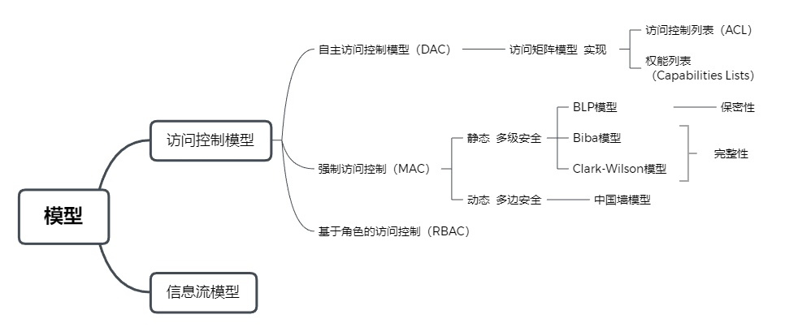

# 第6章 系统安全

## 6.1 计算机系统安全

### 1. 安全的基本系统安全

- 机密性
- 完整性
- 可用性
- 可控性
- 可审查性

扩展：

- 可鉴别性
- 不可抵赖性
- 可靠性

### 2. 可靠性

#### 2.1 涉及的概念

- 平均无故障时间：MTTF
- 平均修复时间：MTTR
- 平均失效间隔：MTBR：两次故障之间的时间
- 失效率：单位时间内失效的元件和总元件的比率，用 符号 表示

#### 2.2 系统可靠性

系统可靠性是系统正常运行的概率，通常用R表示，可靠性和失效率的关系如下：
$$
R=e^{-\lambda}
$$
系统可分为串联系统、并联系统和模冗余系统。

#### 2.3 容错技术

- 硬件容错
  - 双CPU容错
  - 双机热备
  - 三机表决
  - 集群系统
- 软件容错
  - 恢复块RcB
  - N版本程序设计NVP
  - 模糊选举（Fuzzy Voting）
  - 复制指令错误探测（EDDI）
  - SWIFT
- 数据错误
  - 数据备份
  - 数据恢复
  - 容灾技术
  - 数据纠错

### 3. 检错与纠错（学科阶段重点）

海明码距离：两个码字中不相同的二进制位个数

两个码字的码距：一个系统中任意两个码字之间二进制不同的个数

编码系统的码距：任意两个码字间距最小值（最小海明距离）

检测d个错误：编码系统码距 >= d+1

纠正d个错误：编码系统码距 > 2d

#### 3.1 海明码

设检码位为`k`，信息位为`m`，则有
$$
m+k+1 \leq 2^k
$$

#### 3.2 CRC编码：循环冗余校验码

- 生成：设原始串为`10110`，G(x)=x^4+x+1

  1. 原始位后加`0`：G(x)阶为4，则`10110`后添加4个0，得到`101100000`

  2. 多项式除法：
     $$
     10110\sqrt[]{101100000} = \ 1111
     $$
     得到长为r(4)的余数

  3. 将余数添加在原始串末尾，得到`101101111`

- CRC校验

  - 用G(x)来除，余数为0代表无错

注：双方需要使用相同的CRC

常用：CRC-16，CRC-32

### 4.计算机系统结构的安全

### 5. 物理安全

- 物理安全：环境、设备、介质
- 《电子信息系统机房设计规范》
- 机房分级与性能要求：A>B>C
- 机房位置与设备布置
- 建筑与结构
- 电气
- 电磁屏蔽
- 给排水
- 消防
- ...

### 6. 人员安全

## 6.2 操作系统安全

系统安全分级，略

### 1. 操作系统的安全威胁

按分类：途径、表现形式、行为方式

### 2. 安全模型

用于精确和形式的描述信息系统的安全特征，以及用于解释系统安全相关行为的理由

作用：

- 准确的描述安全的重要方面与系统行为的关系
- 提高对成功实现关键安全需求的理解层次
- 可开发一套安全评估准则和关键的描述变量

常见的安全模型

- 状态机模型
- 信息流模型
- 无干扰模型
- 不可推断模型
- 完整性模型
- 中国墙模型

### 3. 访问控制

按机制分：访问控制模型，信息流模型等

手段：口令、登录控制、用户识别、资源授权、核查、日志、审计

类型：防御性、矫正型、探测型、技术型、管理型、操作型

1. 基本概念：主体、客体、授权访问
2. 访问控制机制概念模型：访问控制矩阵、访问控制列表、权能表
3. 自助访问控制：先鉴权、再“ACL”赋予资源
4. 强制访问控制：TESEC ->  B级
   - 多级别安全模型：开放级 < 秘密级 < 机密级 < 绝密级
   - 四种方式：向下读、向上读、向下写、向上写（**必考**）
     - BLP模型：**只允许向下读、向上写**
     - Biba模型：**只允许向上读、向下写**
   - 多边安全模型
5. 基于角色的访问控制

### 4. 操作系统的访问控制

除访问控制外

- 鉴别
- 最小特权原则
- 运行保护机制
- 存储保护机制
- 可信通路机制
- 文件保护
- 安全审计

### 5. 安全操作系统

- 虚拟机法
- 改进/增强法
- 仿真法

## 6.3 数据库安全

定义：保证DB中信息的保密性、完整性、一致性和可用性

常见问题：

- 物理安全
- 逻辑完整性
- 元素完整性
- 可审计性
- 推理控制
- 多级保护
- 访问控制

### 1. 数据库安全性

分为两方面：系统安全性、数据安全性

手段：用户身份认证、存取控制、视图设计、加密存储

### 2. 数据库完整性

1. 设置触发器
2. 两阶段更新：准备阶段、永久更新阶段
3. 纠错与恢复

### 3. 并发控制

一致性、事务的原子性

### 4. 备份与恢复

- 物理备份（冷备份和热备份）和逻辑备份
- 恢复：基于数据转存，基于日志、基于监测点、基于镜像数据库

### 5. 数据库的访问控制

### 6. 安全数据库标准

- TDI
- CC
- 我国的

### 7. 多级安全数据库

对重要的数据进行安全等级划分，通过访问控制、加密等技术实现

## 6.4 嵌入式系统安全

为特定应用设计的专用计算机系统

### 1. 智能卡

分类：略

攻击手段：

1. 物理攻击
2. 时钟抖动
3. 超范围电压探测

### 2. USB Key

### 3. 工控系统安全

面临的安全问题：安全策略和管理流程漏洞、病毒与恶意代码，操作系统漏洞，网络通信协议漏洞

### 4. 智能终端安全

硬件、系统软件、应用软件

