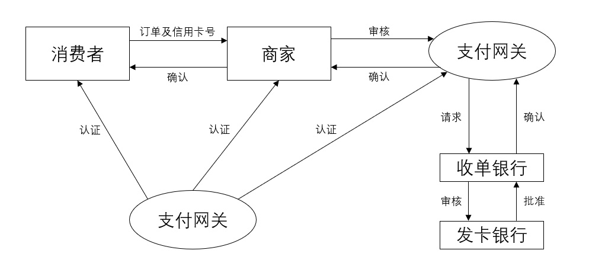

# 第7章 应用安全

## 7.1 Web安全

### 1. Web安全威胁的防护技术

- Web安全的威胁有：Sql注入技术、XSS、SORF、旁注攻击、失效的身份认证、会话管理等
- 访问安全
  - Web访问控制技术
  - 单点登录

### 2. 网页防篡改

篡改：

- 被入侵后页面被篡改
- 网站劫持

防止：

- 时间轮询
- 核心内嵌 + 事件触发技术
- 文件过滤驱动 + 事件触发驱动

### 3. 内容安全

保证内部重要信息不丢失或泄密

电子邮件过滤、网页过滤、反间谍软件

## 7.2 电子商务安全

### 1. 电子商务的定义及安全需求

电子商务的安全问题除了包含计算机系统本身的安全隐患外，还包含了电子商务中数据的安全隐患和交易的安全隐患。

需求：

- 信息保密性需求
- 信息完整性需求
- 交易不可抵赖需求
- 交易对象身份可认证需求
- 服务有效性需求
- 访问控制需求

### 2. 电子商务体系结构

### 3. SET协议！！！

两种安全在线支付协议：SSL协议 和 **SET协议**

SET 协议是应用层协议，是一种基于消息流的协议。能保证信息传输的机密性、真实性、完整性和不可否认性。是PKI框架的典型实现。

基于SET的购物流程 略

安全程度高，结合了DES、RSA、SSL、S-HTTP等提高安全性，还使用了

- 秘密密钥
- 公共密钥
- **数字信封**
- 多密钥对
- 双重签名：巧妙的把发送给不同接受者的两条信息联系在一起，好保护了消费者的隐私

工作流程P211

## 7.3 信息隐藏

### 1. 信息隐藏技术

特性：透明性、鲁棒性、安全性、不可检测性、对称性

分类：隐写术、数字水印、隐蔽通道

### 2. 数字水印技术

1. 数字水印算法

2. 视频水印

3. 《中华人名共和国电子签名法》，2004年8月28日通过，2005年4月1日起实施，现行为2015年4月24日修订版。

## 7.4 隐私保护

分为：个人隐私、通信内容隐私、行为隐私

### 1. 隐私保护技术

1. **基于数据失真的保护**
2. **基于数据加密的技术**
3. **基于数据匿名化的技术**

### 2. 隐私保护度量

披露风险、信息缺失

### 3. 位置隐私保护

目标：用户身份、空间信息、时态信息

方法：假名技术、信息加密、模糊空间和坐标变化等

## 7.5 网络舆情

诱发因素：社会突发公共事件、虚假信息和不良内容

关键技术：网络舆论采集与提取技术、网络舆情话题与追踪技术、网络舆情倾向性分析技术、多文档自动文摘技术