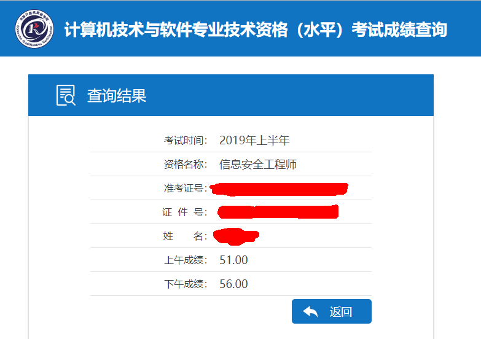

# 软考信息安全工程师学习笔记

注：2019年上半年软考-信息安全工程师笔记整理

笔记内容主要来自《信息安全工程师5天》这本书，这本书比官方教材更精华一些，单纯的考试的话这一本书就够用了，重点划分也比较清晰，就是密码学部分的计算对于以前没接触过的人会有点点吃力。

作为备考，我将书中个人认为比较重要的内容记录在了笔记本上，寻思着考完试了在工作之余整理成电子版，也算是对先前的准备阶段一个回顾，若是能帮到其他人，想必也是极好的。其中的密码学中涉及到数学计算的部分等笔记本上内容整理完我在单独提出来补充，这里面的内容推荐一本学过教材《信息安全数学基础》。

备考期间查到的资料或博客也会归类更新出来，其中几篇讲DES和AES的博客讲得非常仔细。

先更新的也不是最终版，等全部整理成电子版后再进行校对。

github对公式支持的不太好，有的格式都乱了，有空重新写一下弄成图片贴上去。

最近有点忙，中断了部分。

囧...

### TODO

- [x] 添加笔记
- [x] 添加思维导图整理
- [x] 添加往年考试总结
- [x] 基本排版
- [x] 添加目录
- [x] 添加例题步骤
- [x] 添加流程图
- [x] 添加其他阅读过的博客
- [ ] 校对并审核内容
- [x] 添加历年真题
- [ ] 考试中的密码学计算
- [ ] 公式部分重新制图
- [ ] ...

### 目录

[0x01 信息安全基础知识](./01信息安全基础知识.md)

[0x02 安全法规和标准](./02安全法规和标准.md)

[0x03 密码学(上)](./03密码学(上).md)

[0x04 密码学(下)](./04密码学(下).md)

[0x05 计算机网络基础(上)](./05计算机网络基础(上).md)

[0x06 计算机网络基础(下)](./06计算机网络基础(下).md)

[0x07 网络安全](./07网络安全.md)

[0x08 系统安全](./系统安全.md)

[0x09 应用安全](./09应用安全.md)

[0x10 信息系统安全](./10信息系统安全.md)

[0x11 配置安全](./11配置安全.md)

[附1 2016年下半年上午试题总结](./2016年下半年上午试题总结.md)

[附2 2017年上半年上午试题总结](./2017年上半年上午试题总结.md)

[附3 2018年下半年上午试题总结](./2018年上半年上午试题总结.md)

[附4 思维导图整理](./思维导图整理.md)

[附5 信息安全技术课件合集](http://cc.jlu.edu.cn/G2S/Template/View.aspx?courseId=712&topMenuId=132132&action=view&type=&name=&menuType=1&curfolid=132689)

成绩已出：

[License]

good good study，day day up ...